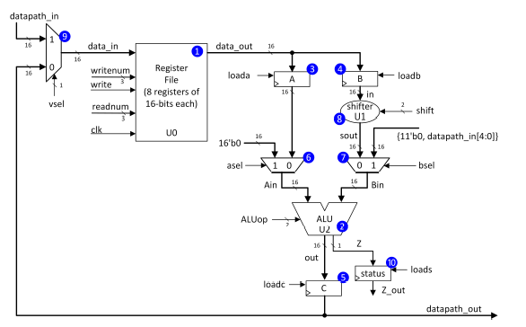
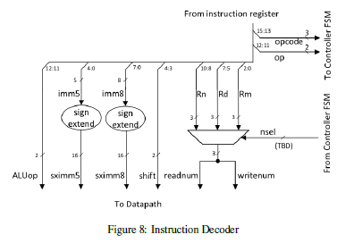
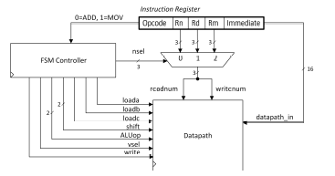

# Simple 16-bit RISC CPU (SystemVerilog)

**A compact multi-cycle CPU with a clean datapath/control split, small RISC-style ISA, and self-checking verification.**

---

## Table of Contents
- [Overview](#overview)
- [Supported Operations](#supported-operations)
- [Microarchitecture](#microarchitecture)
  - [Top Level](#top-level)
  - [Datapath](#datapath)
  - [Register File](#register-file)
  - [Shifter](#shifter)
  - [ALU](#alu)
  - [Instruction Decoder](#instruction-decoder)
  - [Controller FSM](#controller-fsm)
- [Design Choices](#design-choices)
- [Verification & Validation](#verification--validation)
- [Representative Execution Flow](#representative-execution-flow)
- [Future Work](#future-work)

---

## Overview
This project implements a small 16-bit CPU in SystemVerilog with eight general-purpose registers, a shift unit, and an ALU. The design uses a multi-cycle controller to sequence operand capture, execute, and write-back over a simple, readable set of states. The datapath is modular and timing-friendly: register file → operand latches → shifter (B-side) → ALU → result/flags registers → write-back mux.

**What this showcases**
- Clear separation of concerns: datapath components are purely combinational or well-scoped registers; the FSM issues concise enables/selects.
- Integer operations, immediate handling, and shifts common to introductory RISC designs.
- Practical verification: self-checking testbench and waveform inspection to validate control sequencing and data movement.

---

## Supported Operations
- **Data movement**  
  - Move immediate: write an 8-bit sign-extended literal to a register.  
  - Move register: copy a register (optionally shifted) to another register.
- **ALU operations**  
  - Add, Subtract, And, Bitwise Not.
- **Shifts on the B operand**  
  - Logical left, logical right, arithmetic right.
- **Flags**
  - Z (zero), N (negative/sign), V (overflow) are updated on arithmetic/compare as appropriate.

---

## Microarchitecture

### Top Level
- Orchestrates instruction load, decode, control sequencing, and datapath execution.
- Exposes datapath result and condition flags; provides a simple “idle/ready” indicator when the core returns to the wait state.

### Datapath

    

<em>Image as provided by UBC Teaching Team - CPEN 211</em>

- Write-back multiplexer selects between immediate, memory/IO placeholder, PC zero-extended, or the ALU result.
- Two operand latches capture source registers under controller enables.
- B-side passes through a shifter; A/B select signals allow immediate or zero-operand formation where needed (e.g., move/compare forms).
- Result and flags are captured in small registers for stable write-back and status readout.

### Register File
- 8 × 16-bit, single write and single read per cycle.
- One-hot decoders choose the active read and write targets.
- Simple interface keeps timing and synthesis straightforward.

### Shifter
- Supports logical left, logical right, and arithmetic right shifts.
- Applied to the second source operand prior to the ALU to match typical RISC data paths.

### ALU
- Integer add, subtract, and, and bitwise not.
- Sets Z based on result zero, N from the result sign bit, and V on signed overflow for add/sub.

### Instruction Decoder

    

<em>Image as provided by UBC Teaching Team - CPEN 211</em>

- Splits the 16-bit instruction into opcode, sub-op, register specifiers, and immediates.
- Produces sign-extended immediates and shift/ALU control fields.
- Drives compact source/dest selection to avoid wiring ambiguities.

### Controller FSM

    

<em>Image as provided by UBC Teaching Team - CPEN 211</em>

- Small, readable state machine (e.g., wait → decode → load operands → execute → write-back → wait).
- Asserts enables/selects each cycle so the datapath performs one well-defined action per step.
- Compare updates flags without writing a destination register; move-immediate writes directly via the write-back path.

---

## Design Choices
- Multi-cycle control to keep the datapath simple, improve clarity, and reduce resource pressure.
- Operand latching before the ALU to stabilize inputs and simplify timing.
- Minimalistic flag model (Z/N/V) aligned with add/sub semantics; extendable if needed.
- Decoder emits only what the controller/datapath must know, keeping modules loosely coupled.

---

## Verification & Validation
- Self-checking testbench drives hand-assembled instructions, steps the FSM, and asserts expected register contents and flags after each instruction completes.
- Waveforms (ModelSim) used to confirm:
  - Correct decode of register specifiers and immediates.
  - Proper sequencing of operand capture, execute, and write-back.
  - Shifter behavior for all modes.
  - Flag updates on zero/negative and representative overflow cases.
- RTL simulations form the primary signal-level debug; the structure is intended to synthesize cleanly (separate sequential/comb logic, no inferred latches).

---

## Representative Execution Flow
1. Load instruction into the IR.
2. Decode fields (opcode, sub-op, registers, immediates, shift).
3. Capture source operands into A/B latches.
4. Apply optional shift to the B operand; select immediates or zero where required.
5. Execute ALU op and capture result/flags.
6. Write back to the destination register (if the instruction writes a result).
7. Return to the wait state.

---
